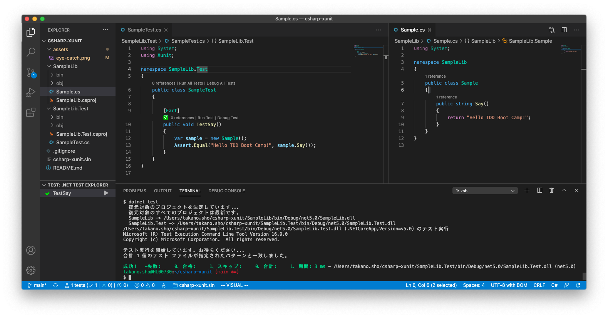

# TDDBC for C# with xUnit.net



TDDBCのC#向けxUnit.netプロジェクトです。


# 必要要件

- .NET 5 SDK

# クイックスタート

```sh
cd (any_work_dir)
git clone https://github.com/tddbc/csharp-xunit.git
cd csharp-xunit
dotnet test
```

